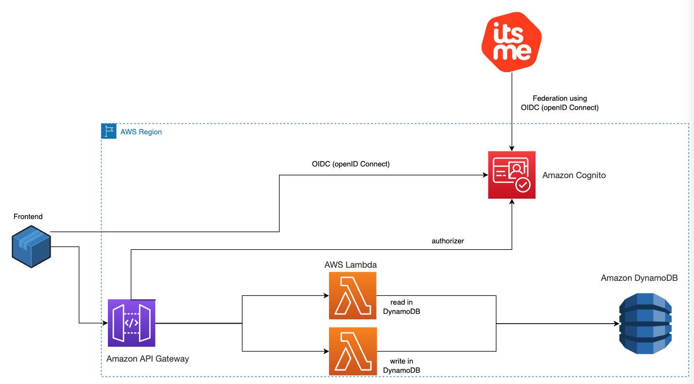
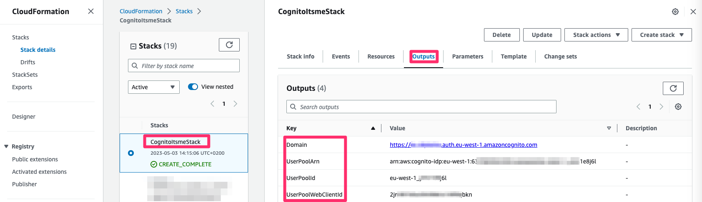
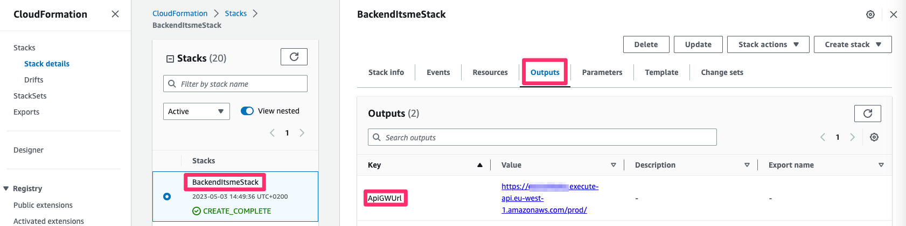
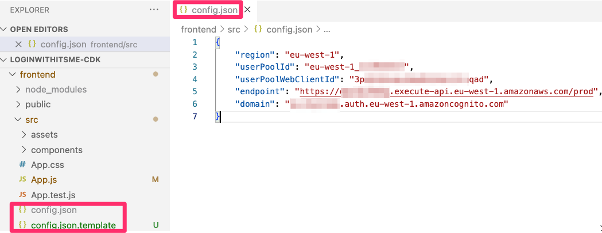
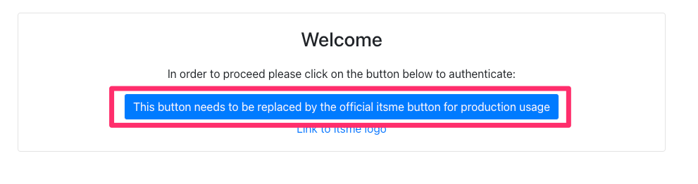
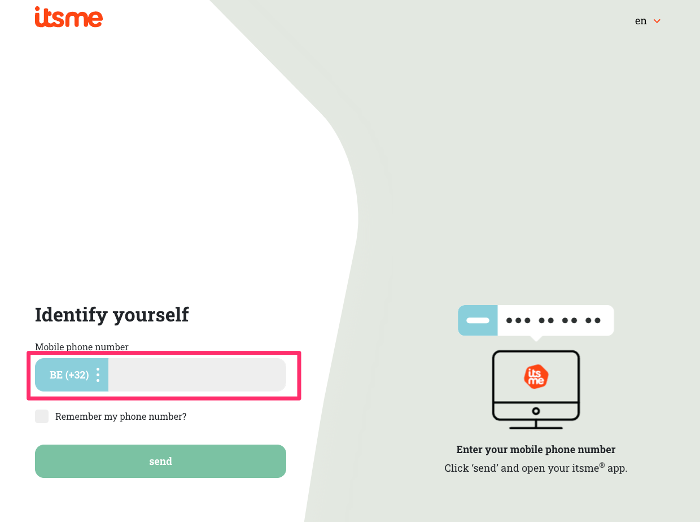
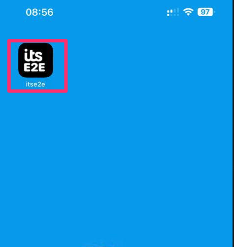
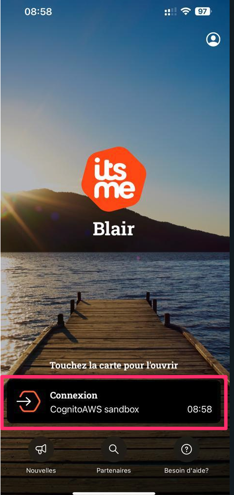
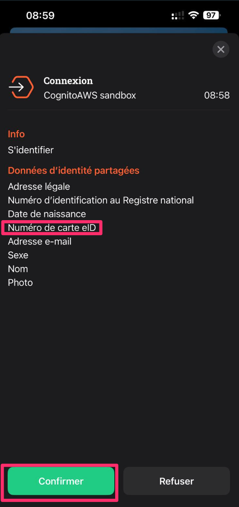
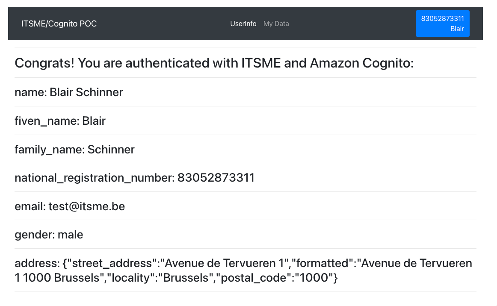

## Login With ITSME PoC: Quick Example

**Architecture principles**



**Solutions specifications**

To showcase the integration we are going to build a minimalistic application made of the following components : 

1. An Amazon Cognito User Pool that support the OIDC federation with Itsme. 
2. A basic front-end application that will offer an authentication portal that will be served locally.
3. An API built on top of Amazon API Gateway from which data are going to be consumed.
4. An API Gateway Lambda authorizer that will consume tokens vended by cognito to authorize API calls.
5. An AWS Lambda function that will read and write from an Amazon DynamoDB database.

*Once deployed:* 

1. An end-user that visit the front-end deployed locally be presented the option to authenticate with Itsme.
2. After being redirected to Itsme, the end-user will be asked to either create a new account or to use an existing one for authentication.
3. Once authenticated with Itsme, the end-user will be redirected to the front-end and will be able to read and write message to and from the database.
4. Meanwhile the associated amazon cognito user-pool will be populated with data requested in the scope of the federation. Specifically the National Registration Number will be made available.


**Before deploying :**
- You must own an AWS Account 
- aws cli and npm needs to be configured on your system
- Clone this git repo

# Included it in this project


**2 CloudFormation templates :**
- 1 to provision the cognito user pool with the itsme federation. Not required If you followed manual instructions to setup the cognito userpool & itsme  
- 1 to provision the backend for our example app
  
**1 React application :**
- 1 in the frontend directory. 

**With the cognito userpool template, you will deploy the following resources :**
- 1 UserPool with the required custom attribute for the federation with itsme
- 1 OIDC Identity Provider (itsme) with required attributes mappings and scopes
- 1 Client Application to be used by our frontend

**With the backend template, you will deploy the following resources :**
- 1 DynamoDB table to store data
- 2 Lambda Functions to read and write from/to the DynamoDB table with the correct IAM Roles/permissions
- 1 API Gateway with 2 differents REST endpoints calling the lambdas
- Setting up Cognito Authorizer

# Deployment

**To deploy the cognito userpool stack :** 

With the aws-cli : ``` aws --region <region> cloudformation create-stack --stack-name CognitoItsmeStack --capabilities CAPABILITY_NAMED_IAM --template-body file://./CognitoItsmeStack.cfn.yaml --parameters ParameterKey=uniquePrefix,ParameterValue=<Domain-name> ParameterKey=itsmeClientId,ParameterValue=<itsme-client-id> ParameterKey=itsmeIssuerURL,ParameterValue=<itsme-issuer-url> ParameterKey=itsmeClientSecret,ParameterValue=<itsme-client-secret> ParameterKey=callBackClientURLs,ParameterValue=<callback-client-url> ParameterKey=itsmeService,ParameterValue=<itsme-service> ```

**To delete :**

With the aws-cli : ```aws --region <region> cloudformation delete-stack --stack-name CognitoItsmeStack```

**Outputs :**




**Note :**
- Default Value (if not provided) are:
  -  itsmeService:  `COGNITOSBX_LOGIN` 
  -  callBackClientURLs: `http://localhost:3000` 
  -  itsmeIssuerURL: `https://oidc.e2e.itsme.services/clientsecret-oidc/csapi/v0.1`
- uniquePrefix is the cognito domain for the user pool
- ClientID and ClientSecret must be provided by ITSME Support


**To deploy the backend stack :** 

With the aws-cli : ```aws --region <region> cloudformation create-stack --stack-name BackendItsmeStack --capabilities CAPABILITY_NAMED_IAM --template-body file://./BackendItsmeStack.cfn.yaml --parameters ParameterKey=cognitoUserPoolArn,ParameterValue=<userpool-arn> ParameterKey=corsallowOrigins,ParameterValue=<cors-allow-origin>```

**Outputs :**



**To delete :**

With the aws-cli : ```aws --region <region> cloudformation delete-stack --stack-name BackendItsmeStack```

**Note :**
- userpool-arn value can be found in the outputs section of the user-pool stack.
- Default Value (if not provided) are: 
  - corsallowOrigins: `http://localhost:3000`
- The log groups of the deployed lambdas are set to retain log for a duration of 1 month
- You can monitor the lambda executions from the cloudwatch logs and the lambda "monitor" panel

**Frontend :**
- Rename the frontend/src/config.json.template file to frontend/src/config.json and replace the following : 
    1. region : With the region associated with your Amazon Cognito user pool.
    2. userPoolId : With the assigned Id of the user pool that you created.
    3. userPoolWebClientId : With the client Id that you retrieved.
    4. domain : With your Amazon Cognito domain in the form of : < your user pool name >.auth.< your region >.amazoncognito.com.




- All Value can be found in the 2 stack outputs
- Start the frontend locally:
```bash
cd frontend
npm i 
npm run start
```

**Login demo :**














## Security

See [CONTRIBUTING](CONTRIBUTING.md#security-issue-notifications) for more information.

## License

This library is licensed under the MIT-0 License. See the LICENSE file.
